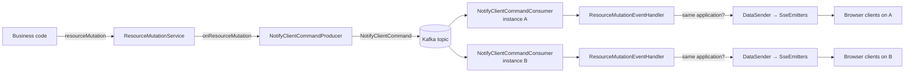

# Architecture

jEAP Server-Sent Events pushes resource-change notifications from a service to its browser clients.
The challenge it solves is **horizontal scaling**: an `EventSource` connection is bound to a single
backend instance, but a change may be triggered on any instance. The library therefore routes every
change through a Kafka topic so all instances forward it to their own connected clients.

## Modules and responsibilities

| Module      | Key types                                                                                            |
|-------------|-------------------------------------------------------------------------------------------------------|
| `core`      | `ResourceMutationService`, `ResourceMutationType`, `ResourceMutationEventHandler`, listener interfaces |
| `messaging` | `NotifyClientCommandProducer`, `NotifyClientCommandConsumer`, contract & topic validators              |
| `web`       | `NotifyClientController` (SSE endpoint), `NotifyClientResourceMutationDataSender`, `NotifyClientHeartbeatSender`, authorization |
| `starter`   | Aggregates the above plus `ServerSentEventsAutoConfiguration`                                          |

## Event flow

A resource mutation travels from business code through Kafka back into every instance's SSE emitters:

Step by step:

1. **Publish.** Business code calls `ResourceMutationService.resourceMutation(type, resourcePath)`.
   The service fans out to all registered `ResourceMutationListener`s; in a configured service the
   only listener is `NotifyClientCommandProducer`.
2. **To Kafka.** The producer builds a `NotifyClientCommand` (Avro) tagged with the sending
   application name and the `resourcePath`, and sends it **synchronously** to `jeap.sse.kafka.topic`.
3. **Consume on every instance.** Each instance runs a `NotifyClientCommandConsumer` with a unique
   listener id (`${spring.application.name}-${random.uuid}`), so all instances receive the command.
4. **Filter.** `ResourceMutationEventHandler` drops commands whose `sendingApplication` differs from
   the instance's own `spring.application.name` — only an application notifies its own clients.
5. **Push.** `NotifyClientResourceMutationDataSender` (a `ResourceMutationEventListener`) serializes
   `{"path": resourcePath}` to JSON and calls `NotifyClientController.sendEvent(type, data)`, which
   writes the event to every active `SseEmitter`.

## The SSE endpoint

`NotifyClientController` exposes `GET ${jeap.sse.web.endpoint}` producing `text/event-stream`. Each
subscribing client gets its own `SseEmitter` (timeout `jeap.sse.web.emitter.timeoutInMs`) added to a
`CopyOnWriteArrayList`; emitters are removed on completion, timeout or error. A separate
`NotifyClientHeartbeatSender` pushes a `HEARTBEAT` event at `jeap.sse.web.heartbeat.rateInMs` to keep
intermediaries from closing idle connections.

## Why only references travel

By design an SSE event carries only an event type and a `resourcePath` reference, never the full
resource data. SSE streams cannot be covered by consumer-driven contract tests, so the client uses
the reference to fetch the current data with a normal, testable REST call.

## Related

- [Getting started](getting-started.md)
- [Configuration reference](configuration.md)
- [Client integration](client-integration.md)
- [jeap-server-sent-events](../README.md)
